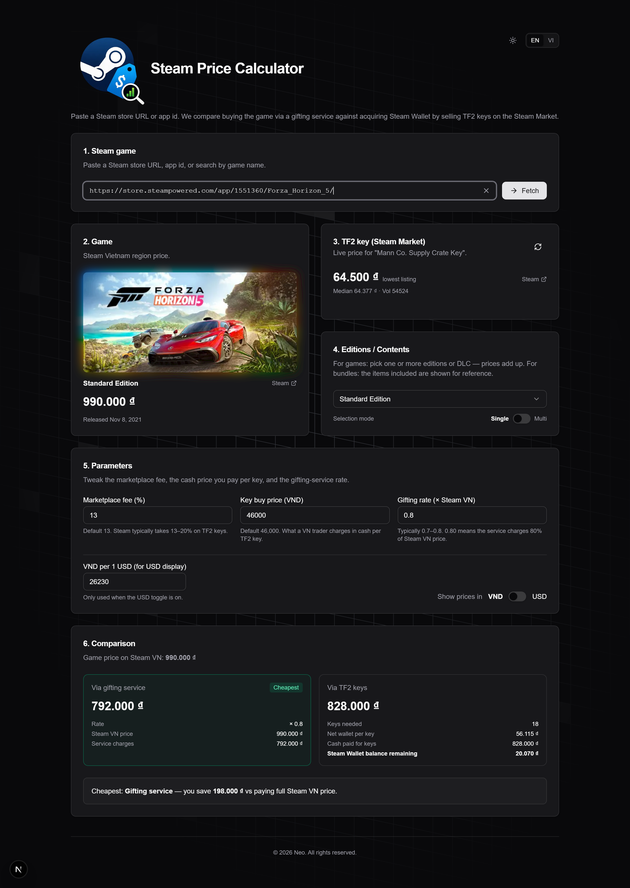
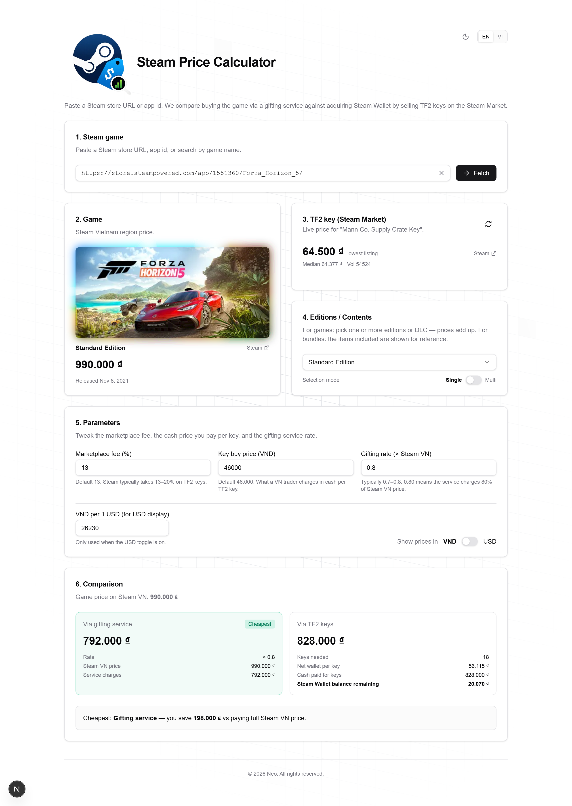

# Steam Price Calculator

Find the cheapest way to buy a Steam game in Vietnam. The app compares two
real-world purchase routes for any Steam title and tells you which one costs
less than paying the Steam VN sticker price:

1. **Buy via a gifting service** — pay a fraction of the Steam VN price in cash.
2. **Sell TF2 keys for Steam Wallet** — buy *Mann Co. Supply Crate Keys*, list
   them on the Steam Market, and spend the (post-fee) Wallet balance on the game.

The Steam Market takes a cut on every sale (~13–20%), so a key listed at
`64,500₫` nets you only ~`56,000₫` of Wallet. Whether keys or gifting wins
shifts with the market — this tool does the math for both and highlights the
winner.

<p align="center">
  
  
</p>

## Features

- **Paste, search, or recall** — accepts a Steam store URL, a bare app id, a
  `/bundle/` URL, or a free-text game name (live Steam search). Recently viewed
  games are remembered in `localStorage`.
- **Editions, DLC & bundles** — pick one or more editions/DLC and their prices
  add up; bundles are priced atomically and list their contents for reference.
- **Live TF2 key price** — pulls the lowest/median listing and sale volume for
  the Mann Co. Supply Crate Key straight from the Steam Market, with a refresh
  button.
- **Side-by-side comparison** — shows keys-needed, net Wallet per key, cash
  spent, leftover Wallet, and the gifting total, then flags the cheapest route
  and your saving (or loss) versus buying directly on Steam VN.
- **Tunable parameters** — marketplace fee %, cash price per key, and the
  gifting rate multiplier are all adjustable.
- **VND ⇄ USD** — toggle the whole UI between VND and USD using a live exchange
  rate (auto-fetched, overridable).
- **English / Vietnamese** and **light / dark** themes.

## How the math works

All calculations live in [lib/calc.ts](lib/calc.ts). Steam VN region prices are
treated as canonical; the US price is fetched best-effort for the USD display.

**TF2-key route**

```
netPerKey   = keyListPrice × (1 − marketplaceFee)   // Wallet you net per sold key
keysNeeded  = ceil(gamePrice / netPerKey)
cashPaid    = keysNeeded × keyBuyPrice               // what you actually pay in cash
walletAfter = keysNeeded × netPerKey − gamePrice     // leftover Wallet (reference only)
```

> `keyListPrice` is the Steam Market listing price (drives the Wallet you
> receive after fees), while `keyBuyPrice` is the cash a VN trader charges per
> key — usually lower, because the trader avoids the per-sale Market fee. The
> route's real cost is `cashPaid`.

**Gifting route**

```
giftTotal = gamePrice × giftingRate                  // e.g. rate 0.80 = 80% of Steam VN
```

The cheaper of `cashPaid` and `giftTotal` wins, and the app reports the
difference against the full Steam VN price.

### Default assumptions

| Parameter            | Default    | Notes                                              |
| -------------------- | ---------- | -------------------------------------------------- |
| Marketplace fee      | `13%`      | Steam typically takes 13–20% on TF2 keys           |
| Key buy price (cash) | `46,000₫`  | Typical VN trader rate per key                     |
| Gifting rate         | `0.80`     | Service charges 80% of the Steam VN price          |
| VND per USD          | `25,500`   | Seed value; replaced by the live rate on load      |

## Tech stack

- [Next.js 16](https://nextjs.org) (App Router, API routes, Turbopack)
- React 19 + TypeScript
- [Tailwind CSS v4](https://tailwindcss.com) + [shadcn/ui](https://ui.shadcn.com) (Radix primitives)
- [TanStack Query](https://tanstack.com/query) for data fetching/caching
- [next-intl](https://next-intl.dev) for i18n, [next-themes](https://github.com/pacocoursey/next-themes) for theming
- [Axios](https://axios-http.com), [Motion](https://motion.dev) for subtle animation

## Getting started

Requires **Node.js 20+**.

```bash
# install dependencies (a yarn.lock is committed)
yarn install

# start the dev server
yarn dev
```

Open [http://localhost:3000](http://localhost:3000), paste a Steam URL such as
`https://store.steampowered.com/app/1551360/Forza_Horizon_5/`, and the
comparison fills in.

### Scripts

| Command       | Description                       |
| ------------- | --------------------------------- |
| `yarn dev`    | Start the dev server (Turbopack)  |
| `yarn build`  | Production build                  |
| `yarn start`  | Serve the production build        |
| `yarn lint`   | Run ESLint                        |

## Project structure

```
app/
  api/
    game/[appid]/       # Steam app price (VN + US) via store appdetails
    bundle/[bundleid]/  # Steam bundle price via ajaxresolvebundles
    tf2-key/            # Lowest/median Mann Co. Supply Crate Key price
    search/             # Steam store search (autocomplete)
    exchange-rate/      # Live VND/USD rate (open.er-api.com)
  layout.tsx            # Root layout, providers, animated background
  page.tsx              # Renders <Calculator />
components/
  calculator.tsx        # Main UI + state orchestration
  versions-card.tsx     # Edition / DLC / bundle-contents selector
  locale-toggle.tsx     # EN / VI switch
  ui/                   # shadcn/ui primitives + custom visual components
lib/
  steam.ts              # Steam API client, parsing, URL/id extraction
  calc.ts               # Pricing math + currency/date formatting
  history.ts            # localStorage-backed recent-search history
i18n/                   # next-intl config, request handler, locale action
messages/               # en.json, vi.json translations
```

## API routes

All server logic lives in Next.js API routes, which proxy and normalize public
Steam endpoints (avoiding browser CORS issues) and add short cache windows.

| Route                     | Source                                   | Cache       |
| ------------------------- | ---------------------------------------- | ----------- |
| `GET /api/game/[appid]`   | Steam `store/api/appdetails` (VN + US)   | 300s        |
| `GET /api/bundle/[id]`    | Steam `actions/ajaxresolvebundles`       | 300s        |
| `GET /api/tf2-key`        | Steam `market/priceoverview` (appid 440) | 120s        |
| `GET /api/search?q=`      | Steam `api/storesearch`                  | 60s         |
| `GET /api/exchange-rate`  | `open.er-api.com` (USD base)             | 3600s       |

> This project relies on undocumented public Steam Store/Community endpoints.
> They can change or rate-limit without notice. Prices are estimates — always
> confirm on Steam before buying.

## Notes & caveats

- Pricing uses the **Steam Vietnam** region; the USD toggle is display-only and
  uses Steam's US price where available, otherwise converts from VND.
- "Complete the set" bundles depend on what you already own and require a
  logged-in session, so the app surfaces a clear message instead of a misleading
  figure.
- This is primarily a personal-use tool, but it's built to production quality.
</content>
